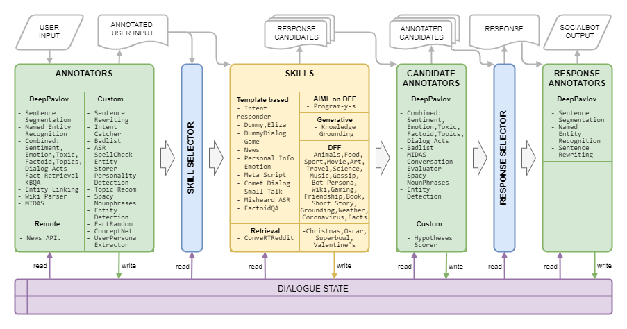
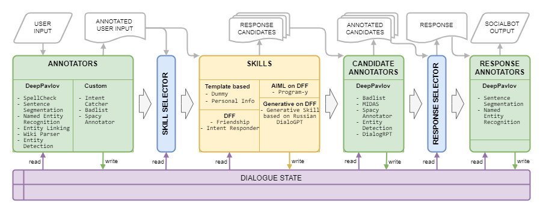

# DeepPavlov Dream

**DeepPavlov Dream** is a platform for creating multi-skill chatbots.

To get architecture documentation, please refer to DeepPavlov Agent [readthedocs documentation](https://deeppavlov-agent.readthedocs.io).

# Distributions

We've already included six distributions: four of them are based on lightweight Deepy socialbot,
one is a full-sized Dream chatbot (based on Alexa Prize Challenge version) in English and a Dream chatbot in Russian.

### Deepy Base

Base version of Lunar assistant.
Deepy Base contains Spelling Preprocessing annotator,
template-based Harvesters Maintenance Skill,
and AIML-based open-domain Program-y Skill based on Dialog Flow Framework.

### Deepy Advanced

Advanced version of Lunar assistant.
Deepy Advanced contains Spelling Preprocessing, Sentence Segmentation,
Entity Linking and Intent Catcher annotators, Harvesters Maintenance GoBot Skill for goal-oriented responses,
and AIML-based open-domain Program-y Skill based on Dialog Flow Framework.

### Deepy FAQ

FAQ version of Lunar assistant.
Deepy FAQ contains Spelling Preprocessing annotator,
template-based Frequently Asked Questions Skill,
and AIML-based open-domain Program-y Skill based on Dialog Flow Framework.

### Deepy GoBot

Goal-oriented version of Lunar assistant.
Deepy GoBot Base contains Spelling Preprocessing annotator,
Harvesters Maintenance GoBot Skill for goal-oriented responses,
and AIML-based open-domain Program-y Skill based on Dialog Flow Framework.

### Dream

Full version of DeepPavlov Dream Socialbot.
This is almost the same version of the DREAM socialbot as at
[the end of Alexa Prize Challenge 4](https://d7qzviu3xw2xc.cloudfront.net/alexa/alexaprize/docs/sgc4/MIPT-DREAM.pdf).
Some API services are replaced with trainable models.
Some services (e.g., News Annotator, Game Skill, Weather Skill) require private keys for underlying APIs,
most of them can be obtained for free.
If you want to use these services in local deployments, add your keys to the environmental variables (e.g., `./.env`).
This version of Dream Socialbot consumes a lot of resources
because of its modular architecture and original goals (participation in Alexa Prize Challenge).
We provide a demo of Dream Socialbot on [our website](https://demo.deeppavlov.ai).

### Dream Mini

Mini version of DeepPavlov Dream Socialbot.
This is a generative-based socialbot that uses [English DialoGPT model](https://huggingface.co/microsoft/DialoGPT-medium) to generate most of the responses. It also contains intent catcher and responder components to cover special user requests.
[Link to the distribution.](https://github.com/deeppavlov/dream/tree/main/assistant_dists/dream_mini)

### Dream Russian

Russian version of DeepPavlov Dream Socialbot. This is a generative-based socialbot that uses [Russian DialoGPT model](https://huggingface.co/Grossmend/rudialogpt3_medium_based_on_gpt2) to generate most of the responses. It also contains intent catcher and responder components to cover special user requests. 
[Link to the distribution.](https://github.com/deeppavlov/dream/tree/main/assistant_dists/dream_russian)

# Quick Start

### Clone the repo

```
git clone https://github.com/deeppavlov/dream.git
```

### Install [docker](https://docs.docker.com/engine/install/) and [docker-compose](https://docs.docker.com/compose/install/)

If you get a "Permission denied" error running docker-compose, make sure to [configure your docker user](https://docs.docker.com/engine/install/linux-postinstall/) correctly.

### Run one of the Dream distributions

#### **Deepy Base**

```
docker-compose -f docker-compose.yml -f assistant_dists/deepy_base/docker-compose.override.yml up --build
```

#### **Deepy Advanced**

```
docker-compose -f docker-compose.yml -f assistant_dists/deepy_adv/docker-compose.override.yml up --build
```

#### **Deepy FAQ**

```
docker-compose -f docker-compose.yml -f assistant_dists/deepy_faq/docker-compose.override.yml up --build
```

#### **Deepy GoBot**

```
docker-compose -f docker-compose.yml -f assistant_dists/deepy_gobot_base/docker-compose.override.yml up --build
```

#### **Dream (via proxy)**

The easiest way to try out Dream is to deploy it via proxy.
All the requests will be redirected to DeepPavlov API, so you don't have to use any local resources.
See [proxy usage](#proxy-usage) for details.

```
docker-compose -f docker-compose.yml -f assistant_dists/dream/docker-compose.override.yml -f assistant_dists/dream/dev.yml -f assistant_dists/dream/proxy.yml up --build
```

#### **Dream (locally)**

**Please note, that DeepPavlov Dream components require a lot of resources.**
Refer to the [components](#components) section to see estimated requirements.

```
docker-compose -f docker-compose.yml -f assistant_dists/dream/docker-compose.override.yml -f assistant_dists/dream/dev.yml up --build
```

We've also included a config with GPU allocations for multi-GPU environments.

```
AGENT_PORT=4242 docker-compose -f docker-compose.yml -f assistant_dists/dream/docker-compose.override.yml -f assistant_dists/dream/dev.yml -f assistant_dists/dream/test.yml up
```

When you need to restart particular docker container without re-building (make sure mapping in `assistant_dists/dream/dev.yml` is correct):

```
AGENT_PORT=4242 docker-compose -f docker-compose.yml -f assistant_dists/dream/docker-compose.override.yml -f assistant_dists/dream/dev.yml restart container-name
```

### Let's chat

DeepPavlov Agent provides several options for interaction: a command line interface, an HTTP API, and a Telegram bot 

#### CLI

In a separate terminal tab run:

```
docker-compose exec agent python -m deeppavlov_agent.run agent.channel=cmd agent.pipeline_config=assistant_dists/dream/pipeline_conf.json
```

Enter your username and have a chat with Dream!

#### HTTP API

Once you've started the bot, DeepPavlov's Agent API will run on `http://localhost:4242`.
You can learn about the API from the [DeepPavlov Agent Docs](https://deeppavlov-agent.readthedocs.io/en/latest/intro/overview.html#http-api-server).

A basic chat interface will be available at `http://localhost:4242/chat`.

#### Telegram Bot
Currently, Telegram bot is deployed **instead** of HTTP API.
Edit `agent` `command` definition inside `docker-compose.override.yml` config:
```
agent:
  command: sh -c 'bin/wait && python -m deeppavlov_agent.run agent.channel=telegram agent.telegram_token=<TELEGRAM_BOT_TOKEN> agent.pipeline_config=assistant_dists/dream/pipeline_conf.json'
```
**NOTE:** treat your Telegram token as a secret and do not commit it to public repositories!

# Configuration and proxy usage

Dream uses several docker-compose configuration files:

`./docker-compose.yml` is the core config which includes containers for DeepPavlov Agent and mongo database;

`./assistant_dists/*/docker-compose.override.yml` lists all components for the distribution;

`./assistant_dists/dream/dev.yml` includes volume bindings for easier Dream debugging;

`./assistant_dists/dream/proxy.yml` is a list of proxied containers.

If your deployment resources are limited, you can replace containers with their proxied copies hosted by DeepPavlov.
To do this, override those container definitions inside `proxy.yml`, e.g.:

```
convers-evaluator-annotator:
  command: ["nginx", "-g", "daemon off;"]
  build:
    context: dp/proxy/
    dockerfile: Dockerfile
  environment:
    - PROXY_PASS=dream.deeppavlov.ai:8004
    - PORT=8004
```

and include this config in your deployment command:

```
docker-compose -f docker-compose.yml -f assistant_dists/dream/docker-compose.override.yml -f assistant_dists/dream/dev.yml -f assistant_dists/dream/proxy.yml up --build
```

By default, `proxy.yml` contains all available proxy definitions.

# Components English Version

Dream Architecture is presented in the following image:


## Annotators

| Name                        | Requirements             | Description                                                                                                                                                                                                                    |
|-----------------------------|--------------------------|--------------------------------------------------------------------------------------------------------------------------------------------------------------------------------------------------------------------------------|
| ASR                         | 40 MiB RAM               | calculates overall ASR confidence for a given utterance and grades it as either _very low_, _low_, _medium_, or _high_ (for Amazon markup)                                                                                     |
| Badlisted words             | 150 MiB RAM              | detects words and phrases from the badlist                                                                                                                                                                                     |
| Combined classification     | 1.5 GiB RAM, 3.5 GiB GPU | BERT-based model including topic classification, dialog acts classification, sentiment, toxicity, emotion, factoid classification                                                                                              |
| COMeT Atomic                | 2 GiB RAM, 1.1 GiB GPU   | Commonsense prediction models COMeT Atomic                                                                                                                                                                                     |
| COMeT ConceptNet            | 2 GiB RAM, 1.1 GiB GPU   | Commonsense prediction models COMeT  ConceptNet                                                                                                                                                                                |
| Convers Evaluator Annotator | 1 GiB RAM, 4.5 GiB GPU   | is trained on the Alexa Prize data from the previous competitions and predicts whether the candidate response is interesting, comprehensible, on-topic, engaging, or erroneous                                                 |
| Entity Detection            | 1.5 GiB RAM, 3.2 GiB GPU | extracts entities and their types from utterances                                                                                                                                                                              |
| Entity Linking              | 640 MB RAM               | finds Wikidata entity ids for the entities detected with Entity Detection                                                                                                                                                      |
| Entity Storer               | 220 MiB RAM              | a rule-based component, which stores entities from the user's and socialbot's utterances if opinion expression is detected with patterns or MIDAS Classifier and saves them along with the detected attitude to dialogue state |
| Fact Random                 | 50 MiB RAM               | returns random facts for the given entity (for entities from user utterance)                                                                                                                                                   |
| Fact Retrieval              | 7.4 GiB RAM, 1.2 GiB GPU | extracts facts from Wikipedia and wikiHow                                                                                                                                                                                      |
| Intent Catcher              | 1.7 GiB RAM, 2.4 GiB GPU | classifies user utterances into a number of predefined intents which are trained on a set of phrases and regexps                                                                                                               |
| KBQA                        | 2 GiB RAM, 1.4 GiB GPU   | answers user's factoid questions based on Wikidata KB                                                                                                                                                                          |
| MIDAS Classification        | 1.1 GiB RAM, 4.5 GiB GPU | BERT-based model trained on a semantic classes subset of MIDAS dataset                                                                                                                                                         |
| MIDAS Predictor             | 30 MiB RAM               | BERT-based model trained on a semantic classes subset of MIDAS dataset                                                                                                                                                         |
| NER                         | 2.2 GiB RAM, 5 GiB GPU   | extracts person names, names of locations, organizations from uncased text                                                                                                                                                     |
| News API annotator          | 80 MiB RAM               | extracts the latest news about entities or topics using the GNews API. DeepPavlov Dream deployments utilize our own API key.                                                                                                   |
| Personality Catcher         | 30 MiB RAM               |                                                                                                                                                                                                                                |
| Rake keywords               | 40 MiB RAM               | extracts keywords from utterances with the help of RAKE algorithm                                                                                                                                                              |
| Relative Persona Extractor  | 50 MiB RAM               | Annotator utilizing Sentence Ranker to rank persona sentences and selecting `N_SENTENCES_OT_RETURN` the most relevant sentences                                                                                                |
| Sentrewrite                 | 200 MiB RAM              | rewrites user's utterances by replacing pronouns with specific names that provide more useful information to downstream components                                                                                             |
| Sentseg                     | 1 GiB RAM                | allows us to handle long and complex user's utterances by splitting them into sentences and recovering punctuation                                                                                                             |
| Spacy Nounphrases           | 180 MiB RAM              | extracts nounphrases using Spacy and filters out generic ones                                                                                                                                                                  |
| Speech Function Classifier  |                          | a hierarchical algorithm based on several linear models and a rule-based approach for the prediction of speech functions described by Eggins and Slade                                                                         |
| Speech Function Predictor   |                          | yields probabilities of speech functions that can follow a speech function predicted by Speech Function Classifier                                                                                                             |
| Spelling Preprocessing      | 30 MiB RAM               | pattern-based component to rewrite different colloquial expressions to a more formal style of conversation                                                                                                                     |
| Topic recommendation        | 40 MiB RAM               | offers a topic for further conversation using the information about the discussed topics and user's preferences. Current version is based on Reddit personalities (see Dream Report for Alexa Prize 4).                        |
| User Persona Extractor      | 40 MiB RAM               | determines which age category the user belongs to based on some key words                                                                                                                                                      |
| Wiki Parser                 | 100 MiB RAM              | extracts Wikidata triplets for the entities detected with Entity Linking                                                                                                                                                       |
| Wiki Facts                  | 1.7 GiB RAM              |                                                                                                                                                                                                                                |

## Services
| Name                   | Requirements              | Description                                                                                                                                                                                              |
|------------------------|---------------------------|----------------------------------------------------------------------------------------------------------------------------------------------------------------------------------------------------------|
| DialoGPT               | 1.2 GiB RAM, 2.1 GiB GPU  | generative service based on Transformers generative model, the model is set in docker compose argument `PRETRAINED_MODEL_NAME_OR_PATH` (for example, `microsoft/DialoGPT-small` with 0.2-0.5 sec on GPU) |
| DialoGPT Persona-based | 1.2 GiB RAM, 2.1 GiB GPU  | generative service based on Transformers generative model, the model was pre-trained on the PersonaChat dataset to generate a response conditioned on a several sentences of the socialbot's persona     |
| Image captioning       | 4 GiB RAM, 5.4 GiB GPU    | creates text representation of a received image                                                                                                                                                          |
| Infilling              | 1  GiB RAM, 1.2 GiB GPU   | (turned off but the code is available) generative service based on Infilling model, for the given utterance returns utterance where `_` from original text is replaced with generated tokens             |
| Knowledge Grounding    | 2 GiB RAM, 2.1 GiB GPU    | generative service based on BlenderBot architecture providing a response to the context taking into account an additional text paragraph                                                                 |
| Masked LM              | 1.1 GiB RAM, 1 GiB GPU    | (turned off but the code is available)                                                                                                                                                                   |
| Sentence Ranker        | 1.2 GiB RAM, 2.1 GiB GPU  | ranking model given as `PRETRAINED_MODEL_NAME_OR_PATH` which for a pair os sentences returns a float score of correspondence                                                                             |
| StoryGPT               | 2.6 GiB RAM, 2.15 GiB GPU | generative service based on fine-tuned GPT-2, for the given set of keywords returns a short story using the keywords                                                                                     |
| Prompt StoryGPT        | 3 GiB RAM, 4 GiB GPU      | generative service based on fine-tuned GPT-2, for the given topic represented by one noun returns short story on a given topic                                                                           |

## Skills
| Name                          | Requirements              | Description                                                                                                                                                                                                        |
|-------------------------------|---------------------------|--------------------------------------------------------------------------------------------------------------------------------------------------------------------------------------------------------------------|
| Christmas Skill               |                           | supports FAQ, facts, and scripts for Christmas                                                                                                                                                                     |
| Comet Dialog skill            |                           | uses COMeT ConceptNet model to express an opinion, to ask a question or give a comment about user's actions mentioned in the dialogue                                                                              |
| Convert Reddit                | 1.2 GiB RAM               | uses a ConveRT encoder to build efficient representations for sentences                                                                                                                                            |
| Dummy Skill                   | a part of agent container | a fallback skill with multiple non-toxic candidate responses                                                                                                                                                       |
| Dummy Skill Dialog            | 600 MiB RAM               | returns the next turn from the Topical Chat dataset if the response of the user to the Dummy Skill is similar to the corresponding response in the source data                                                     |
| Eliza                         | 30 MiB RAM                | Chatbot (https://github.com/wadetb/eliza)                                                                                                                                                                          |
| Emotion skill                 | 40 MiB RAM                | returns template responses to emotions detected by Emotion Classification from Combined Classification annotator                                                                                                   |
| Factoid QA                    | 170 MiB RAM               | answers factoid questions                                                                                                                                                                                          |
| Game Cooperative skill        | 100 MiB RAM               | provides user with a conversation about computer games: the charts of the best games for the past year, past month, and last week                                                                                  |
| Knowledge Grounding skill     | 100 MiB RAM               | generates a response based on the dialogue history and provided knowledge related to the current conversation topic                                                                                                |
| Meta Script skill             | 150 MiB RAM               | provides a multi-turn dialogue around human activities. The skill uses COMeT Atomic model to generate commonsensical descriptions and questions on several aspects                                                 |
| Misheard ASR                  | 40 MiB RAM                | uses the ASR Processor annotations to give feedback to the user when ASR confidence is too low                                                                                                                     |
| News API skill                | 60 MiB RAM                | presents the top-rated latest news about entities or topics using the GNews API                                                                                                                                    |
| Oscar Skill                   |                           | supports FAQ, facts, and scripts for Oscar                                                                                                                                                                         |
| Personal Info skill           | 40 MiB RAM                | queries and stores user's name, birthplace, and location                                                                                                                                                           |
| DFF Program Y skill           | 800 MiB RAM               | **[New DFF version]** Chatbot Program Y (https://github.com/keiffster/program-y) adapted for Dream socialbot                                                                                                       |
| DFF Program Y Dangerous skill | 100 MiB RAM               | **[New DFF version]** Chatbot Program Y (https://github.com/keiffster/program-y) adapted for Dream socialbot, containing responses to dangerous situations in a dialog                                             |
| DFF Program Y Wide skill      | 110 MiB RAM               | **[New DFF version]** Chatbot Program Y (https://github.com/keiffster/program-y) adapted for Dream socialbot, which includes only very general templates (with lower confidence)                                   |
| Small Talk skill              | 35 MiB RAM                | asks questions using the hand-written scripts for 25 topics, including but not limited to love, sports, work, pets, etc.                                                                                           |
| SuperBowl Skill               |                           | supports FAQ, facts, and scripts for SuperBowl                                                                                                                                                                     |
| Text QA                       | 1.8 GiB RAM, 2.8 GiB GPU  |                                                                                                                                                                                                                    |
| Valentine's Day Skill         |                           | supports FAQ, facts, and scripts for Valentine's Day                                                                                                                                                               |
| Wikidata Dial Skill           |                           | generates an utterance using Wikidata triplets. Not turned on, needs improvement                                                                                                                                   |
| DFF Animals skill             | 200 MiB RAM               | is created using DFF and has three branches of conversation about animals: user's pets, pets of the socialbot, and wild animals                                                                                    |
| DFF Art skill                 | 100 MiB RAM               | DFF-based skill to discuss art                                                                                                                                                                                     |
| DFF Book skill                | 400 MiB RAM               | **[New DFF version]** detects book titles and authors mentioned in the user's utterance with the help of Wiki parser and Entity linking and recommends books by leveraging information from the GoodReads database |
| DFF Bot Persona skill         | 150 MiB RAM               | aims to discuss user favorites and 20 most popular things with short stories expressing the socialbot's opinion towards them                                                                                       |
| DFF Coronavirus skill         | 110 MiB RAM               | **[New DFF version]** retrieves data about the number of coronavirus cases and deaths in different locations sourced from the John Hopkins University Center for System Science and Engineering                    |
| DFF Food skill                | 150 MiB RAM               | constructed with DFF to encourage food-related conversation                                                                                                                                                        |
| DFF Friendship skill          | 100 MiB RAM               | **[New DFF version]** DFF-based skill to greet the user in the beginning of the dialog, and forward the user to some scripted skill                                                                                |
| DFF Funfact skill             | 100 MiB RAM               | **[New DFF version]** Tells user fun facts                                                                                                                                                                         |
| DFF Gaming skill              | 80 MiB RAM                | provides a video games discussion. Gaming Skill is for more general talk about video games                                                                                                                         |
| DFF Gossip skill              | 95 MiB RAM                | DFF-based skill to discuss other people with news about them                                                                                                                                                       |
| DFF Grounding skill           | 90 MiB RAM                | **[New DFF version]** DFF-based skill to answer what is the topic of the conversation, to generate acknowledgement, to generate universal responses on some dialog acts by MIDAS                                   |
| DFF Intent Responder          | 100 MiB RAM               | **[New DFF version]**  provides template-based replies for some of the intents detected by Intent Catcher annotator                                                                                                |
| DFF Movie skill               | 1.1 GiB RAM               | is implemented using DFF and takes care of the conversations related to movies                                                                                                                                     |
| DFF Music skill               | 70 MiB RAM                | DFF-based skill to discuss music                                                                                                                                                                                   |
| DFF Science skill             | 90 MiB RAM                | DFF-based skill to discuss science                                                                                                                                                                                 |
| DFF Short Story skill         | 90 MiB RAM                | **[New DFF version]** tells user short stories from 3 categories: (1) bedtime stories, such as fables and moral stories, (2) horror stories, and (3) funny ones                                                    |
| DFF Sport Skill               | 70 MiB RAM                | DFF-based skill to discuss sports                                                                                                                                                                                  |
| DFF Travel skill              | 70 MiB RAM                | DFF-based skill to discuss travel                                                                                                                                                                                  |
| DFF Weather skill             | 1.4 GiB RAM               | **[New DFF version]** uses the OpenWeatherMap service to get the forecast for the user's location                                                                                                                  |
| DFF Wiki skill                | 150 MiB RAM               | used for making scenarios with the extraction of entities, slot filling, facts insertion, and acknowledgements                                                                                                     |

# Components Russian Version

Dream Architecture is presented in the following image:


## Annotators

| Name                   | Requirements             | Description                                                                                                                                                                   |
|------------------------|--------------------------|-------------------------------------------------------------------------------------------------------------------------------------------------------------------------------|
| Badlisted words        | 50 MiB RAM               | detects obscene Russian words from the badlist                                                                                                                                |
| Entity detection       | 3  GiB RAM               | extracts entities and their types from utterances                                                                                                                             |
| Entity linking         | 500 MiB RAM, ?? GiB GPU  | finds Wikidata entity ids for the entities detected with Entity Detection                                                                                                     |
| Intent catcher         | 900 MiB RAM              | classifies user utterances into a number of predefined intents which are trained on a set of phrases and regexps                                                              |
| NER                    | 1.7 GiB RAM, 4.9 Gib GPU | extracts person names, names of locations, organizations from uncased text using ruBert-based (pyTorch) model                                                                 |
| Sentseg                | 2.4 GiB RAM, 4.9 Gib GPU | recovers punctuation using ruBert-based (pyTorch) model and splits into sentences                                                                                             |
| Spacy Annotator        | 250 MiB RAM              | token-wise annotations by Spacy                                                                                                                                               |
| Spelling preprocessing | 4.4 GiB RAM              | Russian Levenshtein correction model                                                                                                                                          |
| Wiki parser            | 100 MiB RAM              | extracts Wikidata triplets for the entities detected with Entity Linking                                                                                                      |
| DialogRPT              | 3.8 GiB RAM,  2 GiB GPU  | DialogRPT model which is based on Russian DialoGPT (see https://huggingface.co/Grossmend/rudialogpt3_medium_based_on_gpt2) and fine-tuned on Russian Pikabu Comment sequences |

## Skills & Services
| Name                   | Requirements              | Description                                                                                                                         |
|------------------------|---------------------------|-------------------------------------------------------------------------------------------------------------------------------------|
| DialoGPT               | 2.8 GiB RAM, 2 GiB GPU    | Russian DialoGPT model https://huggingface.co/Grossmend/rudialogpt3_medium_based_on_gpt2                                            |
| Dummy Skill            | a part of agent container | a fallback skill with multiple non-toxic candidate responses and random Russian questions                                           |
| Personal Info skill    | 40 MiB RAM                | queries and stores user's name, birthplace, and location                                                                            |
| DFF Generative skill   | 50 MiB RAM                | **[New DFF version]** generative skill which uses DialoGPT service to generate 3 different hypotheses                               |
| DFF Intent Responder   | 50 MiB RAM                | provides template-based replies for some of the intents detected by Intent Catcher annotator                                        |
| DFF Program Y skill    | 80 MiB RAM                | **[New DFF version]** Chatbot Program Y (https://github.com/keiffster/program-y) adapted for Dream socialbot                        |
| DFF Friendship skill   | 70 MiB RAM                | **[New DFF version]** DFF-based skill to greet the user in the beginning of the dialog, and forward the user to some scripted skill |
| DFF Wiki skill         | 150 MiB RAM               | used for making scenarios with the extraction of entities, slot filling, facts insertion, and acknowledgements                      |


# Components Multilingual Version

Dream Architecture is presented in the following image:


## Annotators

| Name                     | Requirements             | Description                                                                                                                                                    |
|--------------------------|--------------------------|----------------------------------------------------------------------------------------------------------------------------------------------------------------|
| Sentiment Classification | 2 GiB RAM, 2 GiB GPU     | classifies sentiment to positive, negative and neutral classes                                                                                                 |
| Toxic Classification     | 3  GiB RAM, 2 GiB GPU    | classifies toxicity: identity_attack, insult, obscene, severe_toxicity, sexual_explicit, threat, toxicity                                                      |
| Sentence Ranker          | 2.5 GiB RAM, 1.8 GiB GPU | for a pair of sentences predicts a floating point value. For multilingual version, return cosine similarity between embeddings from multilingual sentence BERT |

## Skills & Services
| Name           | Requirements           | Description                                                                                                                                       |
|----------------|------------------------|---------------------------------------------------------------------------------------------------------------------------------------------------|
| gpt2-generator | 5 GiB RAM, 6.5 GiB GPU | GPT2-based generative model. For Multilingual distribution we propose mgpt by Sberbank [from HugginFace](https://huggingface.co/sberbank-ai/mGPT) |

# Papers

### Alexa Prize 3

[Kuratov Y. et al. DREAM technical report for the Alexa Prize 2019 //Alexa Prize Proceedings. – 2020.](https://m.media-amazon.com/images/G/01/mobile-apps/dex/alexa/alexaprize/assets/challenge3/proceedings/Moscow-DREAM.pdf)

### Alexa Prize 4

[Baymurzina D. et al. DREAM Technical Report for the Alexa Prize 4 //Alexa Prize Proceedings. – 2021.](https://d7qzviu3xw2xc.cloudfront.net/alexa/alexaprize/docs/sgc4/MIPT-DREAM.pdf)

# License

DeepPavlov Dream is licensed under Apache 2.0.

Program-y (see `dream/skills/dff_program_y_skill`, `dream/skills/dff_program_y_wide_skill`, `dream/skills/dff_program_y_dangerous_skill`)
is licensed under Apache 2.0.
Eliza (see `dream/skills/eliza`) is licensed under MIT License.

## Report creating

For making certification `xlsx` - file with bot responses, you can use `xlsx_responder.py` script by executing

```shell
docker-compose -f docker-compose.yml -f dev.yml exec -T -u $(id -u) agent python3 \
        utils/xlsx_responder.py --url http://0.0.0.0:4242 \
        --input 'tests/dream/test_questions.xlsx' \
        --output 'tests/dream/output/test_questions_output.xlsx'\
      --cache tests/dream/output/test_questions_output_$(date --iso-8601=seconds).json
```

Make sure all services are deployed. `--input` - `xlsx` file with certification questions, `--output` - `xlsx` file with bot responses, `--cache` - `json`, that contains a detailed markup and is used for a cache.
