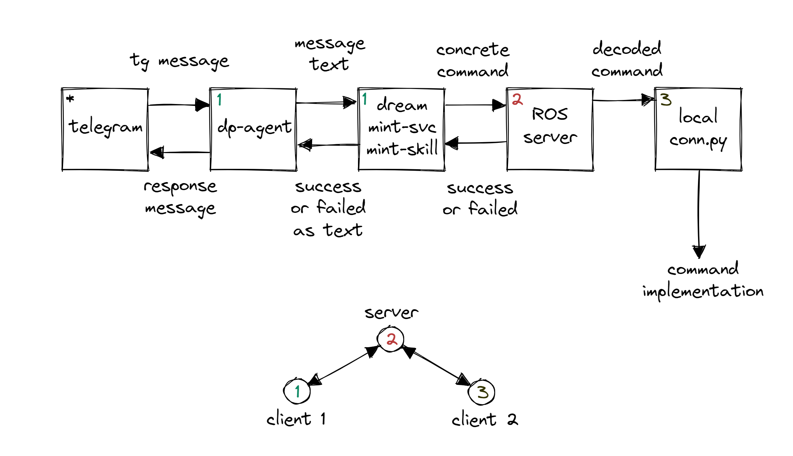

# dream_embodied distribution



This distribution functions the following way:
1. Receives user input from the dp-agent of choice (e.g. Telegram);
2. Processes the received input in a way that results in a command (e.g. move forward 4 meters -> `move_forward_4`);
3. Sends the command to the ROS server (in order to make interacting with real robots possible);
4. Processes the message from inside ROS server and accesses a local connector (e.g. real robot ROS-API, minecraft-interface);
5. (While not done in dream-side, it is useful to know that) the local connector then executes a command that usually corresponds with the message we received in step 2.

# Prerequisites:

1. Make sure that all services are correctly defined in dev.yml, proxy.yml, pipeline_conf.json;
2. Ensure that the ports for services and skills are unique and that the ports referenced by services and skills are correct;
3. Verify that in docker-compose.override.yml, the following is set: agent.channel=telegram agent.telegram_token=$TG_TOKEN;
4. Use the @botfather bot in Telegram to create your own chatbot and to receive your personal telegram bot token (TG_TOKEN);
5. Ensure that the Telegram bot token is set in the environment variables as $TG_TOKEN by executing the following command on the Dream host machine: `export $TG_TOKEN=...`.

# Launch command:

```
docker-compose -f docker-compose.yml -f assistant_dists/dream_embodied/docker-compose.override.yml -f \
assistant_dists/dream_embodied/dev.yml -f assistant_dists/dream_embodied/proxy.yml up --build
```

Attention! The last part of the command stops all running containers on the machine. If this is not required, remove the part of the command after the semicolon or edit it to stop only specific containers if their names are known in advance.